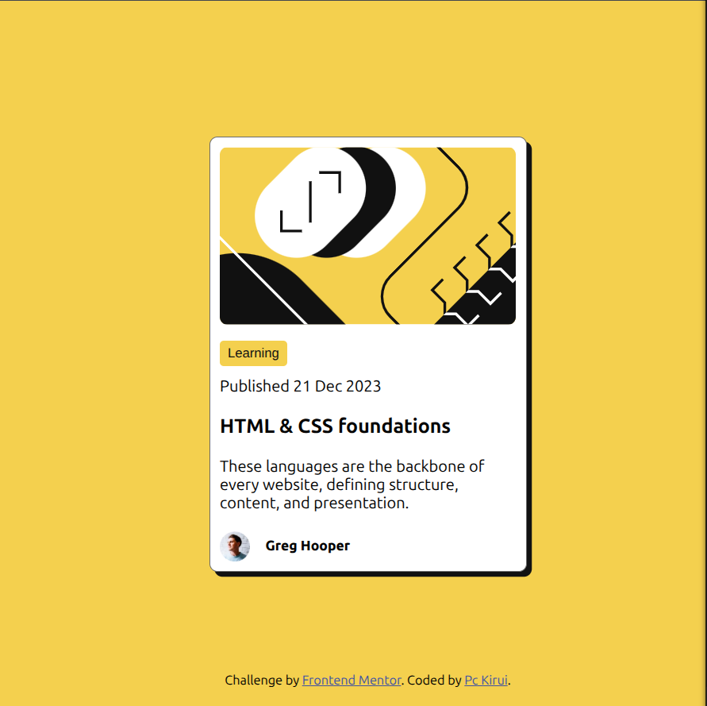

# Frontend Mentor - Blog preview card solution

This is a solution to the [Blog preview card challenge on Frontend Mentor](https://www.frontendmentor.io/challenges/blog-preview-card-ckPaj01IcS). Frontend Mentor challenges help you improve your coding skills by building realistic projects.

## Table of contents

- [Overview](#overview)
  - [The challenge](#the-challenge)
  - [Screenshot](#screenshot)
  - [Links](#links)
- [My process](#my-process)
  - [Built with](#built-with)
  - [What I learned](#what-i-learned)
  - [Continued development](#continued-development)
  - [Useful resources](#useful-resources)
- [Author](#author)

## Overview

### The challenge

Users should be able to:

- See hover and focus states for all interactive elements on the page

### Screenshot

Above is a screenshot of my solution as seen from my Pc.

### Links

- Solution URL: [Add solution URL here](https://your-solution-url.com)
- Live Site URL: [Add live site URL here](https://your-live-site-url.com)

## My process

### Built with

- Semantic HTML5 markup
- CSS custom properties
- Flexbox

### What I learned

Was given some design templates for this project and was able to come up with similar designs. In this project I learned more about flexible designs using CSS width and max-width properties.

Also learned about hover and focus states on interactive elements, and how they can be used to improve usability and accessibility of websites.

### Continued development

- CSS Length values
- CSS color values
- CSS pseudo classes

### Useful resources

- Did a recap on basic color and length properties. Checkout these [Getting to know CSS](https://learn.shayhowe.com/html-css/getting-to-know-css/) to take a deeper look on some basic CSS properties.

## Author

- Website - [Patrick Cheruiyot Kirui](https://pc-kirui.github.io/)
- Frontend Mentor - [@Pc-Kirui](https://www.frontendmentor.io/profile/Pc-Kirui)
- Twitter - [@PcKirui](https://x.com/PcKirui)
